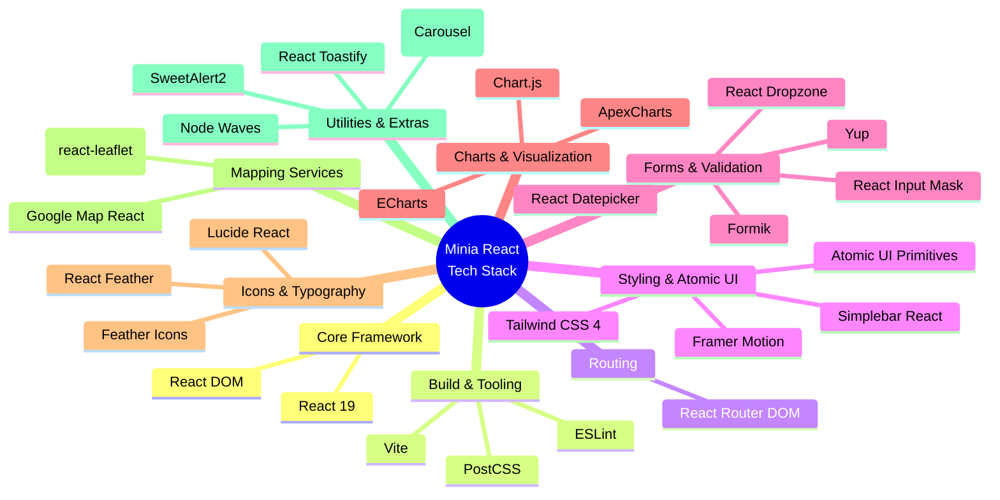

# Minia React Tech Stack Mindmap

This document visualizes the core technologies, libraries, and frameworks used in the project.

## Mindmap Visualization

## Detailed Breakdown

### Core Framework & Build Tools
- **React (v19)**: The core JavaScript library for building user interfaces.
- **Vite**: A fast, modern frontend build tool and development server.
- **Tailwind CSS 4**: Modern, high-performance atomic CSS framework for all styling.
- **ESLint**: Used to maintain code quality and styling consistency.

### Routing
- **React Router DOM**: Declarative routing for React applications, handling the page navigation.

### Styling and Layout
- **Atomic UI Components**: A custom, high-fidelity UI library built with Tailwind CSS and Framer Motion.
- **Framer Motion**: Used for fluid animations, layout transitions, and interactive components.
- **Simplebar React**: Custom scrollbar implementation.
- **Node Waves**: Click effect inspired by Google's Material Design.
- **SweetAlert2**: Beautiful, responsive, customizable popup boxes.

### Forms and Data Handling
- **Formik**: Helps with building forms in React (managing state, validation, handling submissions).
- **Yup**: A JavaScript schema builder for value parsing and validation (often paired with Formik).
- **React Datepicker**: A simple and reusable datepicker component.
- **React Input Mask**: Input masking for formatted data like phone numbers or dates.
- **React Dropzone**: Simple HTML5 drag-and-drop zone for file uploads.

### Data Visualization & Charts
- **ApexCharts** (`react-apexcharts`): Interactive and responsive charts.
- **Chart.js** (`react-chartjs-2`): Simple yet flexible JavaScript charting.
- **ECharts** (`echarts-for-react`): A powerful, interactive charting and visualization library.

### Icons
- **Lucide React**: Beautiful & consistent icon toolkit.
- **React Feather**: React component for Feather icons.

### Maps
- **Leaflet / React Leaflet**: Open-source JavaScript library for mobile-friendly interactive maps.
- **Google Map React**: A component written over a small set of the Google Maps API.

### Notifications and Miscellaneous
- **React Toastify**: Used to add notifications to the app smoothly.
- **React Slick / Slick Carousel**: A carousel component built with React.

---
**Note**: Legacy Bootstrap dependencies and Sass have been fully purged in favor of an atomic Tailwind CSS architecture.
